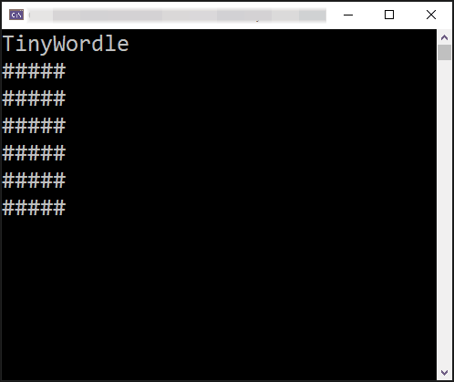
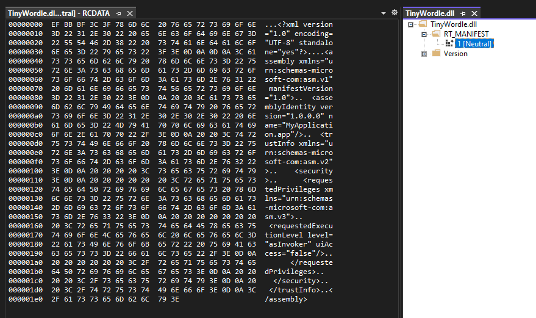
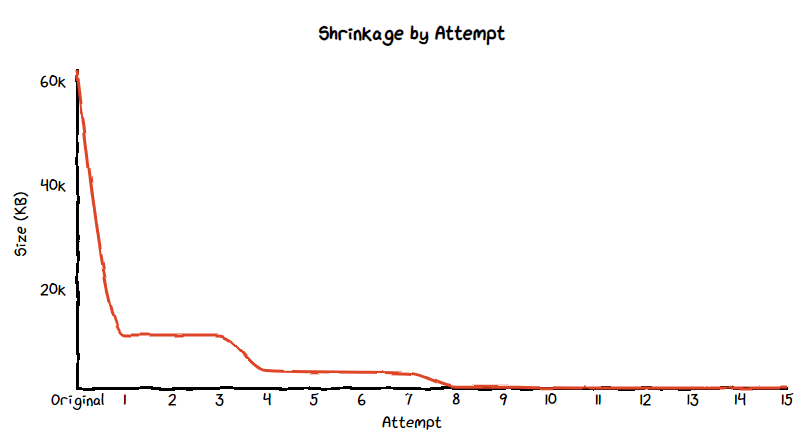

# TinyWordle: 62,091 KB to 1,011 KB
A C# console clone of Wordle, but with an attempt to make the binary really tiny.

Based off the popular [Wordle game](https://www.nytimes.com/games/wordle/index.html) where the rule are:


Each attempt at shinking the final binary will have it's own project to easily compare and understand the steps taken. 

Console work helped out by [Console Games - Snake](https://dev.to/pcmichaels/console-games-snake-part-1-3jfg)

The project was kicked off via `dotnet new console`.

## Basic Game Overview


Pretty similar to the original given the constraints.

## Shrinking
The whole shrinking thing is something I've wanted to try and emulate since the fantastic [Building a self-contained game in C# under 8 kilobytes](https://medium.com/@MStrehovsky/building-a-self-contained-game-in-c-under-8-kilobytes-74c3cf60ea04) post by [Michal Strehovský](https://twitter.com/MStrehovsky). You can see the source at the GitHub repo: [SeeSharpSnake](https://github.com/MichalStrehovsky/SeeSharpSnake)

Each shrinking attempt will be around looking at a published `.exe` in Release mode. The executable will be able to run stand alone without needing .NET on the target machine. We can achieve this by publishing as a [Single File Application](https://docs.microsoft.com/en-us/dotnet/core/deploying/single-file/overview) by modifying the `.csproj` file with:
```xml
<PropertyGroup>
	<PublishSingleFile>true</PublishSingleFile>
</PropertyGroup>
```

However, I will be targeting x64 Windows. And to make sure it works, I'll be playing one game after each attempt to see if it still works.

## Original
The `00 original` folder is about getting the game going with no attempt to think about efficiency. It's left as is, warts and all. There are some inefficencies, useless assignments, etc. But that's all part of this game to shrink the file - we need a baseline *somewhere*.

```
dotnet publish -r win-x64 -c Release

Total binary size: 62,091 KB
```

## Attempt 1 (-50,902 KB)
I can probably get the biggest gain by setting the [Trimming options](https://docs.microsoft.com/en-us/dotnet/core/deploying/trimming/trimming-options). 

We can trim either by adding it as a publish argument or via the `.csproj` file. I've opted to add `PublishTrimmed` to the `.csproj` file:
```xml
<PropertyGroup>
	<PublishTrimmed>true</PublishTrimmed>
</PropertyGroup>
```
```
dotnet publish -r win-x64 -c Release

Total binary size: 11,189 KB
```

## Attempt 2 (-0 KB)
We can also [tune the trimming options](https://docs.microsoft.com/en-us/dotnet/core/deploying/trimming/trimming-options#trimming-granularity), and the easiest switch to flick is `TrimMode`. However, out of the two options:
1. `link`
1. `copyused` 

.NET6 by default uses the more aggressive one, `link`. Meaning we won't see any size change even if explicitly stating it in the `.csproj` file.
```xml
<PropertyGroup>
	<TrimMode>link</TrimMode>
</PropertyGroup>
```
```
dotnet publish -r win-x64 -c Release

Total binary size: 11,189 KB
```

## Attempt 3 (- 16 KB)
Onward with trimming, we can [trim our assembly](https://docs.microsoft.com/en-us/dotnet/core/deploying/trimming/trimming-options#trim-additional-assemblies) to skim off a little more space.
```xml
<ItemGroup>
	<TrimmableAssembly Include="TinyWordle" />
</ItemGroup>
```
```
dotnet publish -r win-x64 -c Release

Total binary size: 11,173 KB
```

## Attempt 4 (-6,825 KB)
Time for some [experimental native AOT](https://github.com/dotnet/runtimelab/tree/feature/NativeAOT-LLVM). If you know about CoreRT, I believe this is the next successor. This attempt will simply be adding it to the project via [this document](https://github.com/dotnet/runtimelab/blob/feature/NativeAOT/docs/using-nativeaot/compiling.md).

Note: that you will have to install the C++ Development module of Visual Studio for this to work.

Note: I did have to remove the `PublishSingleFile` element from the `.csproj` file otherwise the publish fails when using AOT.

```
dotnet publish -r win-x64 -c Release

Total binary size: 4,348 KB
```

## Attempt 5 (-221 KB)
Looking at the [root documentation](https://github.com/dotnet/runtimelab/tree/feature/NativeAOT/docs/using-nativeaot) it looks like we can [optimise](https://github.com/dotnet/runtimelab/blob/feature/NativeAOT/docs/using-nativeaot/optimizing.md)!
```xml
<PropertyGroup>
	<InvariantGlobalization>true</InvariantGlobalization>
</PropertyGroup>
```
```
dotnet publish -r win-x64 -c Release

Total binary size: 4,127 KB
```

## Attempt 6 (-69 KB, nice)
On the same [optimisation page](https://github.com/dotnet/runtimelab/blob/feature/NativeAOT/docs/using-nativeaot/optimizing.md) it also describes a `IlcOptimizationPreference` option and we can set this as `size`.
```xml
<PropertyGroup>
	<IlcOptimizationPreference>Size</IlcOptimizationPreference>
</PropertyGroup>
```
```
dotnet publish -r win-x64 -c Release

Total binary size: 4,058 KB
```

## Attempt 7 (-199 KB)
Next up is setting `IlcFoldIdenticalMethodBodies` which according to the [docs](https://github.com/dotnet/runtimelab/blob/feature/NativeAOT/docs/using-nativeaot/optimizing.md#options-related-to-code-generation) can get a bit weird with stack traces. 
```xml
<PropertyGroup>
	<IlcFoldIdenticalMethodBodies>true</IlcFoldIdenticalMethodBodies>
</PropertyGroup>
```
```
dotnet publish -r win-x64 -c Release

Total binary size: 3,859 KB
```

## Attempt 8 (-2,692 KB)
Now for some [metadata options](https://github.com/dotnet/runtimelab/blob/feature/NativeAOT/docs/using-nativeaot/optimizing.md#options-related-to-metadata-generation). First up is setting `IlcDisableReflection`, which disables all the reflection based metadata generation. Things can get a bit funky when we begin picking off relfection parts of .NET though. 

```xml
<PropertyGroup>
	<IlcDisableReflection>true</IlcDisableReflection>
</PropertyGroup>
```
```
dotnet publish -r win-x64 -c Release

Total binary size: 1,167 KB
```

## Attempt 9 (-0 KB)
Metadata? Who needs it. Time for [`IlcTrimMetadata` to shine](https://github.com/dotnet/runtimelab/blob/feature/NativeAOT/docs/using-nativeaot/optimizing.md#options-related-to-metadata-generation). Though it turns out, I might already have a whole bunch removed as for this attempt, it didn't do much for me.

```xml
<PropertyGroup>
	<IlcTrimMetadata>true</IlcTrimMetadata>
</PropertyGroup>
```
```
dotnet publish -r win-x64 -c Release

Total binary size: 1,167 KB
```

## Attempt 10 (-129 KB)
[`IlcGenerateStackTraceData`](https://github.com/dotnet/runtimelab/blob/feature/NativeAOT/docs/using-nativeaot/optimizing.md#options-related-to-metadata-generation) is next up to attempt to cut bytes.

```xml
<PropertyGroup>
	<IlcGenerateStackTraceData>false</IlcGenerateStackTraceData>
</PropertyGroup>
```
```
dotnet publish -r win-x64 -c Release

Total binary size: 1,038 KB
```

## Attempt 11 (-10 KB)
Now that we've exhausted the switches I can find, it's time to go back look at the code.

### Smallest Limit
Without tinkering with the linker and the build toolchain, it seems the smallest value I can get an `.exe` is around **975 KB**. I tested this by removing all references to the actual TinyWordle code and just did a simple `Console.Writeline("");` in `program.cs`. 

This means I think a good goal is to get the codebase to be sub 1 MB, or 1,024 KB - and according to the attempt 10 amount, only 14 bytes need to be shaved off. So let's see where we can lose them.

### Record Structs (-0 KB)
Specifically in reducing the amount of MSIL we create. First up, we're going to look at the `GuessedWord` and `GuessedLetter` `struct`s. Looking at [this example from SharpLap.io](https://sharplab.io/#v2:EYLgZgpghgLgrgJwgZwLTIgWygOxgSwGN0d8AHMiGZAGgBMQBqAHwAEAmARgFgAoVgMwACJFDoB7HABsAniIiFxCOkOQwEcQjCEBxOCgx0A6kroAKVpwAMQk8oCUAbj59Bq9Zu16DEY6fZ8AN58QqFCbpY2diqBQgDmVI5CAL4hYW7eyIbR7BbWQgDupvZCwbxhFbamQgC8habO5WGpvMlAA), a record produces a lot more code. 

However, while this might impact the final size, for my two `struct` use case, converted them away from records did not change the resulting file size.

### Random (-0 KB)
Originally I was selecting the word via creating a new `Random` object. However, you can also get a random number via a static call, `Random.Shared.Next()`. Replacing the object with the static call did not change the resulting file size.

### Random v2 (-2 KB)
Using the [random `struct`](https://github.com/MichalStrehovsky/SeeSharpSnake/blob/master/Game/Random.cs) from the [whole inspriation from this little project](https://medium.com/@MStrehovsky/building-a-self-contained-game-in-c-under-8-kilobytes-74c3cf60ea04) shaved off 2 KB.
```
dotnet publish -r win-x64 -c Release

Total binary size: 1,036 KB
```

### No more `.ToLower()` (-5 KB)
As long as our user doesn't use any upper case they'll be fine. Shaves off 5 KB.
```
dotnet publish -r win-x64 -c Release

Total binary size: 1,031 KB
```

### No more `.WriteLine()` (-1 KB)
Since I need to use `Console.Write()` to colour specific characters, I can remove the `WriteLine()` calls and just append `/r/n` to the necessary calls.

```
dotnet publish -r win-x64 -c Release

Total binary size: 1,030 KB
```

### No more `.Contains()` (- 512 B)
A really small one, but just creating a basic method to replace the built in `string.Contains()` method. While it didn't save enough to make a difference on the rounded binary size. At least this time the size changed - unlike other attempts. 

```
dotnet publish -r win-x64 -c Release

Total binary size: 1,030 KB
```

### No more `Console.ReadKey()` (-2 KB)
To continue or quit the game after winning/losing, I opted to use a `ReadKey()` call so the user could go straight back into the game. That's now been replaced with a `ReadLine()` meaning the user has to hit enter to continue. But that's worth the saving.

```
dotnet publish -r win-x64 -c Release

Total binary size: 1,028 KB
```

### Swapping out `while` (-0 KB)
I was thinking since I'm using `for` anyway, I could use the `for(;;)` infinite loop syntax instead of `while(true)`. Turns out, they both end up as the same thing for IL.

## Attempt 12 (-0 KB)
Quick list of things that failed
- Changing things from/to class/structs/records/etc
- Removing the new `Random` and hard coding a value
- Many others

After spend awhile looking through the code myself, I figured it was time to see the actual output of the publish. Previously I had used the Visual Studio Performance Profiler to help me out to see what calls are being made where. But I'm now ready to see what I can see from the AOT output.

I will be using the following:
```xml
<PropertyGroup>
	<IlcGenerateDgmlFile>true</IlcGenerateDgmlFile>
	<IlcGenerateMapFile>true</IlcGenerateMapFile>
	<IlcDumpGeneratedIL>true</IlcDumpGeneratedIL>
</PropertyGroup>
```

Looking at the dumps of what is linked, it's all the core library things like `System.Threading`, `System.Collections`, and things like the various primitive types. I understand now why the snake game creator went to the toolchain and I can see things being linked.

As for now, I dont understand enough about Interop, Importing DLLs, or want to get into messing with the toolchain. 

## Attempt 13 (-1 KB)
Still not with the toolchain, just ideas that come to me now and again.

### Removing `Console.ResetColor()` (-0 KB)
Attempted to remove the `Console.ResetColor()` calls with `Console.BackgroundColor = ConsoleColor.Black`

### Removing `?` and `<Nullable>enable</Nullable>` (-0 KB)
Removing nullable checks, and setting `<Nullable>disable</Nullable>` in the `csproj`.

### Not using `new` for creating structs (-0 KB)
The `Random`, `GuessedLetter`, and `GuessedWord` structs and using them like pritimives. However this didn't seem to change anything - unless I did something wrong 🤔

### Not using `string.IsNullOrEmpty()` (-0 KB)
Opting to use manual empty string and null checks. However I think because they are part of the core library that even if the classes/methods aren't used, theyre included. 

### Removing the `Console.Write(char value)` call with a `Console.Write(string? value)` call (-1 KB)
Each letter is printed via the `char` implementation of `Console.Write()` however the `string` version is also present. And as the `.ToString()` method is part of the core library and not trimmed, then we can make each printed `char` a `string`.
```
dotnet publish -r win-x64 -c Release

Total binary size: 1,027 KB
```

### Using `Console.SetCursorPosition()` instead of `Console.Clear()` (-0 KB)
Didn't work. Made it bigger by 2KB.

### Overriding base calls (-0 KB)
Thinking about overriding `ToString()` and similar. Looked at the changed via SharpLab.io and while the JIT ASM does get shorter, the trimmer removes them anyway since they aren't used by my custom types.

### More switches (-0 KB)
Tried more [switches via the trimming documentation](https://github.com/dotnet/runtime/blob/main/docs/workflow/trimming/feature-switches.md#available-feature-switches)

### `<TrimmableAssembly Include="System.Private.CoreLib" />` (-0 KB)
Nope, no change/

### Custom app.manifest (-512 B)
Embedded in the binaries is the manifest file. Not entirely sure what it does, but the game runs without it.
Did this by adding a new app.manifest and putting nothing it, then putting this in the `.csproj` file:
```xml
<ApplicationManifest>app.manifest</ApplicationManifest>
```



Viewed by opening the `.dll` into Visual Studio

```xml
<?xml version="1.0" encoding="UTF-8" standalone="yes"?>

<assembly xmlns="urn:schemas-microsoft-com:asm.v1" manifestVersion="1.0">
  <assemblyIdentity version="1.0.0.0" name="MyApplication.app"/>
  <trustInfo xmlns="urn:schemas-microsoft-com:asm.v2">
    <security>
      <requestedPrivileges xmlns="urn:schemas-microsoft-com:asm.v3">
        <requestedExecutionLevel level="asInvoker" uiAccess="false"/>
      </requestedPrivileges>
    </security>
  </trustInfo>
</assembly>
```

Remember to delete the obj folder after changing the manifest or else 
```
LINK : fatal error LNK1123: failure during conversion to COFF: file invalid or corrupt
```

Sadly not enough to change the KB rounding:
```
dotnet publish -r win-x64 -c Release

Total binary size: 1,027 KB
```

### Removing `System.SpanHelpers.SequenceEqual()` (-0 KB)

To see if the user wants to quit, there's this call:
```csharp
shouldContinue == "q"
```

Which according to sharplab.io turns into:
```
call System.SpanHelpers.SequenceEqual(Byte ByRef, Byte ByRef, UIntPtr)
```

So to get around that I made it simplier
```csharp
shouldContinue[0] == 'q'
```

Which made it some simple compares in IL assembly

However, it didn't make a difference because I think `System.SpanHelpers` is part of the core so they're loaded in anyway.

###  `[MethodImpl(MethodImplOptions.AggressiveInlining)]` (-1 KB)
From my super limited understanding, inlining can increase code side as code is copy/pasted by the compliler to throw it right in sequential order instead of jumping all around the code base for the next call. 

However, it seems in my case, it has reduced my code size when put on particular functions. 

```
dotnet publish -r win-x64 -c Release

Total binary size: 1,026 KB
```

### Changing up the `Contains()` function
```csharp
// old one
public static bool Contains(string stringToSearch, char characterToFind)
{
	for (int i = 0; i < stringToSearch.Length; i++)
	{
		if (stringToSearch[i] == characterToFind)
		{
			return true;
		}
	}

	return false;
}

// new one
public static bool Contains2(string s, char c)
{
	return s.IndexOf(c) != -1;
}
```
Didn't make a change, it seems the compliler knew smarter ways to do this

## Attempt 14 (-0 KB)
This attempt uses [dnSpy](https://github.com/dnSpy/dnSpy) (which is now outdated, and you can use [ILSpy](https://github.com/icsharpcode/ILSpy)) to check out what is being bundled with the `.exe`.

It also is the attempt where coding practices are thrown out the window.

### Removing any structs from user code (-0 KB)
Nope. Didn't help. Was hoping that even if structs were part of the core library that the generated binary would be less. Seems not. 

### Removing type references to `char` (-0 KB)
Also didn't help. 

### Moving to single file
Actually made it larger

### Taking the internal implementation of dotnet functions
Theoretrically this then gets rid of the guards and other overheads. But turns out this is way too above what I'm doing because I have to unravel lots of stuff

## Attempt 15 (-16 KB)
The light linker playing round, trying flags from the [MSVC linker documentation](https://docs.microsoft.com/en-us/cpp/build/reference/linker-options?view=msvc-170). I do try a lot more options than written, but mostly with zero effect.

### `DYNAMICBASE:NO` (-15 KB)
Adding some linker arguments, specifically turning off address space layout randomisation via [`DYNAMICBASE:NO`](https://docs.microsoft.com/en-us/cpp/build/reference/dynamicbase-use-address-space-layout-randomization?view=msvc-170) to the `csproj` file.
```csharp
<ItemGroup>
	<LinkerArg Include="/DYNAMICBASE:NO" />
</ItemGroup>
```
```
dotnet publish -r win-x64 -c Release

Total binary size: 1,011 KB
```

### `/SUBSYSTEM:CONSOLE` (-0 KB)
Nothing out of messing with the [`subsystem`](https://docs.microsoft.com/en-us/cpp/build/reference/subsystem?view=msvc-170) flag.

### `/ASSEMBLYDEBUG:DISABLE` (-0 KB)
Nothing out of messing with the [`assemblydebug`](https://docs.microsoft.com/en-us/cpp/build/reference/assemblydebug-add-debuggableattribute?view=msvc-170) flag.

### `/FILEALIGN:2` (-0 KB)
From what I know from alignment, it's about lining up memory sizes. Maybe something like, if a bit is stored, but the alignment is 1 byte, then that 1 bit will take the space of 1 byte. 
According to the [documentation](https://docs.microsoft.com/en-us/cpp/build/reference/filealign?view=msvc-170), this needs to be a power of 2, and 0 makes it worse.

**Except** while the `.exe` was produced. It couldn't run.

## Result
Go check out the value yourself over at the [releases area for attempt 15](https://github.com/nikouu/TinyWordle/releases/tag/15-Attempt)


*Chart via this [chart.xkcd example](https://codepen.io/timqian/pen/GRKqLaL)*

| Attempts | Size (KB) | Reduction |
| -------- | --------: | --------: |
| Original |    62,091 |         - |
| 1        |    11,189 |    81.98% |
| 2        |    11,189 |    81.98% |
| 3        |    11,173 |    82.01% |
| 4        |     4,348 |    93.00% |
| 5        |     4,127 |    93.35% |
| 6        |     4,058 |    93.46% |
| 7        |     3,859 |    93.78% |
| 8        |     1,167 |    98.12% |
| 9        |     1,167 |    98.12% |
| 10       |     1,038 |    98.33% |
| 11       |     1,028 |    98.34% |
| 12       |     1,028 |    98.34% |
| 13       |     1,027 |    98.35% |
| 14       |     1,026 |    98.35% |
| 15       |     1,011 |    98.37% |


## Future ideas
- Taking advantage of the toolchain to bring in only core functions that are needed
- Use `stackalloc`?
- ~~using a decomplilation tool to look at the IL and imports that are packaged up and see which from the non core library can be removed~~

## Secret Attempt 16 👀
[Native AOT is now present as of .NET 7 Preview 3](https://devblogs.microsoft.com/dotnet/announcing-dotnet-7-preview-3/#faster-lighter-apps-with-native-aot) and it might be fun to see how all of the above work translates into this new version.
