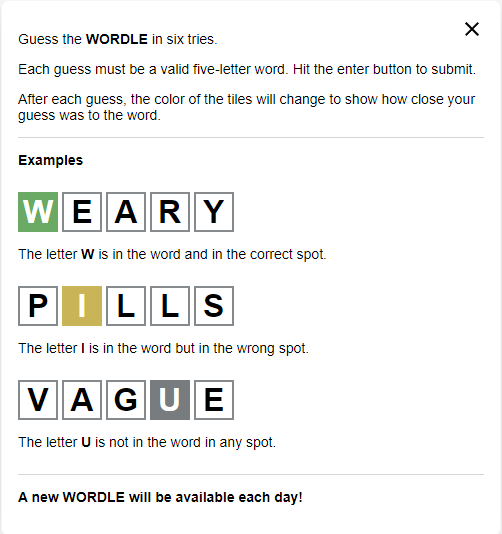
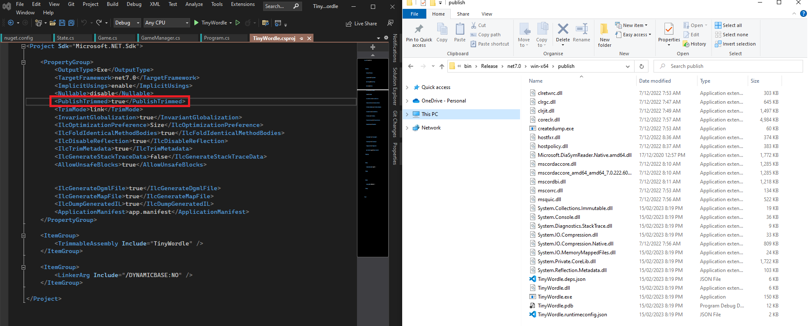

# TinyWordle: 62,091 KB to 1,011 KB (Now 703 KB!)
A C# console clone of Wordle, but with an attempt to make the binary really tiny. 

👉 [Check out my writeup on my blog!](https://www.nikouusitalo.com/blog/shrinking-a-self-contained-net-6-wordle-clone-executable/)👈

Based off the popular [Wordle game](https://www.nytimes.com/games/wordle/index.html) where the rule are:



Each attempt at shinking the final binary will have it's own project to easily compare and understand the steps taken. 

Console work helped out by [Console Games - Snake](https://dev.to/pcmichaels/console-games-snake-part-1-3jfg)

The project was kicked off via `dotnet new console`.

## Basic Game Overview


Pretty similar to the original given the constraints.

_Why do I put the attempts in different folders rather than branches? To be honest, I didn't expect to go this far in attempts so the code was just lumped together in a few attempts. But it's a really fun project and it just kept going._

## Shrinking
The whole shrinking thing is something I've wanted to try and emulate since the fantastic [Building a self-contained game in C# under 8 kilobytes](https://medium.com/@MStrehovsky/building-a-self-contained-game-in-c-under-8-kilobytes-74c3cf60ea04) post by [Michal Strehovský](https://twitter.com/MStrehovsky). You can see the source at the GitHub repo: [SeeSharpSnake](https://github.com/MichalStrehovsky/SeeSharpSnake)

Each shrinking attempt will be around looking at a published `.exe` in Release mode. The executable will be able to run stand alone without needing .NET on the target machine. We can achieve this by publishing as a [Single File Application](https://docs.microsoft.com/en-us/dotnet/core/deploying/single-file/overview) by modifying the `.csproj` file with:
```xml
<PropertyGroup>
	<PublishSingleFile>true</PublishSingleFile>
</PropertyGroup>
```

However, I will be targeting x64 Windows. And to make sure it works, I'll be playing one game after each attempt to see if it still works.

## Original
The `00 original` folder is about getting the game going with no attempt to think about efficiency. It's left as is, warts and all. There are some inefficiencies, useless assignments, etc. But that's all part of this game to shrink the file - we need a baseline *somewhere*.

```
dotnet publish -r win-x64 -c Release

Total binary size: 62,091 KB
```

## Attempt 1 (-50,902 KB)
I can probably get the biggest gain by setting the [Trimming options](https://docs.microsoft.com/en-us/dotnet/core/deploying/trimming/trimming-options). 

We can trim either by adding it as a publish argument or via the `.csproj` file. I've opted to add `PublishTrimmed` to the `.csproj` file:
```xml
<PropertyGroup>
	<PublishTrimmed>true</PublishTrimmed>
</PropertyGroup>
```
```
dotnet publish -r win-x64 -c Release

Total binary size: 11,189 KB
```

## Attempt 2 (-0 KB)
We can also [tune the trimming options](https://docs.microsoft.com/en-us/dotnet/core/deploying/trimming/trimming-options#trimming-granularity), and the easiest switch to flick is `TrimMode`. However, out of the two options:
1. `link`
1. `copyused` 

.NET6 by default uses the more aggressive one, `link`. Meaning we won't see any size change even if explicitly stating it in the `.csproj` file.
```xml
<PropertyGroup>
	<TrimMode>link</TrimMode>
</PropertyGroup>
```
```
dotnet publish -r win-x64 -c Release

Total binary size: 11,189 KB
```

## Attempt 3 (- 16 KB)
Onward with trimming, we can [trim our assembly](https://docs.microsoft.com/en-us/dotnet/core/deploying/trimming/trimming-options#trim-additional-assemblies) to skim off a little more space.
```xml
<ItemGroup>
	<TrimmableAssembly Include="TinyWordle" />
</ItemGroup>
```
```
dotnet publish -r win-x64 -c Release

Total binary size: 11,173 KB
```

## Attempt 4 (-6,825 KB)
Time for some [experimental native AOT](https://github.com/dotnet/runtimelab/tree/feature/NativeAOT-LLVM). If you know about CoreRT, I believe this is the next successor. This attempt will simply be adding it to the project via [this document](https://github.com/dotnet/runtimelab/blob/feature/NativeAOT/docs/using-nativeaot/compiling.md).

Note: that you will have to install the C++ Development module of Visual Studio for this to work.

Note: I did have to remove the `PublishSingleFile` element from the `.csproj` file otherwise the publish fails when using AOT.

```
dotnet publish -r win-x64 -c Release

Total binary size: 4,348 KB
```

## Attempt 5 (-221 KB)
Looking at the [root documentation](https://github.com/dotnet/runtimelab/tree/feature/NativeAOT/docs/using-nativeaot) it looks like we can [optimise](https://github.com/dotnet/runtimelab/blob/feature/NativeAOT/docs/using-nativeaot/optimizing.md)!
```xml
<PropertyGroup>
	<InvariantGlobalization>true</InvariantGlobalization>
</PropertyGroup>
```
```
dotnet publish -r win-x64 -c Release

Total binary size: 4,127 KB
```

## Attempt 6 (-69 KB, nice)
On the same [optimisation page](https://github.com/dotnet/runtimelab/blob/feature/NativeAOT/docs/using-nativeaot/optimizing.md) it also describes a `IlcOptimizationPreference` option and we can set this as `size`.
```xml
<PropertyGroup>
	<IlcOptimizationPreference>Size</IlcOptimizationPreference>
</PropertyGroup>
```
```
dotnet publish -r win-x64 -c Release

Total binary size: 4,058 KB
```

## Attempt 7 (-199 KB)
Next up is setting `IlcFoldIdenticalMethodBodies` which according to the [docs](https://github.com/dotnet/runtimelab/blob/feature/NativeAOT/docs/using-nativeaot/optimizing.md#options-related-to-code-generation) can get a bit weird with stack traces. 
```xml
<PropertyGroup>
	<IlcFoldIdenticalMethodBodies>true</IlcFoldIdenticalMethodBodies>
</PropertyGroup>
```
```
dotnet publish -r win-x64 -c Release

Total binary size: 3,859 KB
```

## Attempt 8 (-2,692 KB)
Now for some [metadata options](https://github.com/dotnet/runtimelab/blob/feature/NativeAOT/docs/using-nativeaot/optimizing.md#options-related-to-metadata-generation). First up is setting `IlcDisableReflection`, which disables all the reflection based metadata generation. Things can get a bit funky when we begin picking off relfection parts of .NET though. 

```xml
<PropertyGroup>
	<IlcDisableReflection>true</IlcDisableReflection>
</PropertyGroup>
```
```
dotnet publish -r win-x64 -c Release

Total binary size: 1,167 KB
```

## Attempt 9 (-0 KB)
Metadata? Who needs it. Time for [`IlcTrimMetadata` to shine](https://github.com/dotnet/runtimelab/blob/feature/NativeAOT/docs/using-nativeaot/optimizing.md#options-related-to-metadata-generation). Though it turns out, I might already have a whole bunch removed as for this attempt, it didn't do much for me.

```xml
<PropertyGroup>
	<IlcTrimMetadata>true</IlcTrimMetadata>
</PropertyGroup>
```
```
dotnet publish -r win-x64 -c Release

Total binary size: 1,167 KB
```

## Attempt 10 (-129 KB)
[`IlcGenerateStackTraceData`](https://github.com/dotnet/runtimelab/blob/feature/NativeAOT/docs/using-nativeaot/optimizing.md#options-related-to-metadata-generation) is next up to attempt to cut bytes.

```xml
<PropertyGroup>
	<IlcGenerateStackTraceData>false</IlcGenerateStackTraceData>
</PropertyGroup>
```
```
dotnet publish -r win-x64 -c Release

Total binary size: 1,038 KB
```

## Attempt 11 (-10 KB)
Now that we've exhausted the switches I can find, it's time to go back look at the code.

### Smallest Limit
Without tinkering with the linker and the build toolchain, it seems the smallest value I can get an `.exe` is around **975 KB**. I tested this by removing all references to the actual TinyWordle code and just did a simple `Console.Writeline("");` in `program.cs`. 

This means I think a good goal is to get the codebase to be sub 1 MB, or 1,024 KB - and according to the attempt 10 amount, only 14 bytes need to be shaved off. So let's see where we can lose them.

### Record Structs (-0 KB)
Specifically in reducing the amount of MSIL we create. First up, we're going to look at the `GuessedWord` and `GuessedLetter` `struct`s. Looking at [this example from SharpLap.io](https://sharplab.io/#v2:EYLgZgpghgLgrgJwgZwLTIgWygOxgSwGN0d8AHMiGZAGgBMQBqAHwAEAmARgFgAoVgMwACJFDoB7HABsAniIiFxCOkOQwEcQjCEBxOCgx0A6kroAKVpwAMQk8oCUAbj59Bq9Zu16DEY6fZ8AN58QqFCbpY2diqBQgDmVI5CAL4hYW7eyIbR7BbWQgDupvZCwbxhFbamQgC8habO5WGpvMlAA), a record produces a lot more code. 

However, while this might impact the final size, for my two `struct` use case, converted them away from records did not change the resulting file size.

### Random (-0 KB)
Originally I was selecting the word via creating a new `Random` object. However, you can also get a random number via a static call, `Random.Shared.Next()`. Replacing the object with the static call did not change the resulting file size.

### Random v2 (-2 KB)
Using the [random `struct`](https://github.com/MichalStrehovsky/SeeSharpSnake/blob/master/Game/Random.cs) from the [whole inspriation from this little project](https://medium.com/@MStrehovsky/building-a-self-contained-game-in-c-under-8-kilobytes-74c3cf60ea04) shaved off 2 KB.
```
dotnet publish -r win-x64 -c Release

Total binary size: 1,036 KB
```

### No more `.ToLower()` (-5 KB)
As long as our user doesn't use any upper case they'll be fine. Shaves off 5 KB.
```
dotnet publish -r win-x64 -c Release

Total binary size: 1,031 KB
```

### No more `.WriteLine()` (-1 KB)
Since I need to use `Console.Write()` to colour specific characters, I can remove the `WriteLine()` calls and just append `/r/n` to the necessary calls.

```
dotnet publish -r win-x64 -c Release

Total binary size: 1,030 KB
```

### No more `.Contains()` (- 512 B)
A really small one, but just creating a basic method to replace the built in `string.Contains()` method. While it didn't save enough to make a difference on the rounded binary size. At least this time the size changed - unlike other attempts. 

```
dotnet publish -r win-x64 -c Release

Total binary size: 1,030 KB
```

### No more `Console.ReadKey()` (-2 KB)
To continue or quit the game after winning/losing, I opted to use a `ReadKey()` call so the user could go straight back into the game. That's now been replaced with a `ReadLine()` meaning the user has to hit enter to continue. But that's worth the saving.

```
dotnet publish -r win-x64 -c Release

Total binary size: 1,028 KB
```

### Swapping out `while` (-0 KB)
I was thinking since I'm using `for` anyway, I could use the `for(;;)` infinite loop syntax instead of `while(true)`. Turns out, they both end up as the same thing for IL.

## Attempt 12 (-0 KB)
Quick list of things that failed
- Changing things from/to class/structs/records/etc
- Removing the new `Random` and hard coding a value
- Many others

After spend awhile looking through the code myself, I figured it was time to see the actual output of the publish. Previously I had used the Visual Studio Performance Profiler to help me out to see what calls are being made where. But I'm now ready to see what I can see from the AOT output.

I will be using the following:
```xml
<PropertyGroup>
	<IlcGenerateDgmlFile>true</IlcGenerateDgmlFile>
	<IlcGenerateMapFile>true</IlcGenerateMapFile>
	<IlcDumpGeneratedIL>true</IlcDumpGeneratedIL>
</PropertyGroup>
```

Looking at the dumps of what is linked, it's all the core library things like `System.Threading`, `System.Collections`, and things like the various primitive types. I understand now why the snake game creator went to the toolchain and I can see things being linked.

As for now, I don't understand enough about Interop, Importing DLLs, or want to get into messing with the toolchain. 

## Attempt 13 (-1 KB)
Still not with the toolchain, just ideas that come to me now and again.

### Removing `Console.ResetColor()` (-0 KB)
Attempted to remove the `Console.ResetColor()` calls with `Console.BackgroundColor = ConsoleColor.Black`

### Removing `?` and `<Nullable>enable</Nullable>` (-0 KB)
Removing nullable checks, and setting `<Nullable>disable</Nullable>` in the `csproj`.

### Not using `new` for creating structs (-0 KB)
The `Random`, `GuessedLetter`, and `GuessedWord` structs and using them like primitives. However this didn't seem to change anything - unless I did something wrong 🤔

### Not using `string.IsNullOrEmpty()` (-0 KB)
Opting to use manual empty string and null checks. However I think because they are part of the core library that even if the classes/methods aren't used, they're included. 

### Removing the `Console.Write(char value)` call with a `Console.Write(string? value)` call (-1 KB)
Each letter is printed via the `char` implementation of `Console.Write()` however the `string` version is also present. And as the `.ToString()` method is part of the core library and not trimmed, then we can make each printed `char` a `string`.
```
dotnet publish -r win-x64 -c Release

Total binary size: 1,027 KB
```

### Using `Console.SetCursorPosition()` instead of `Console.Clear()` (-0 KB)
Didn't work. Made it bigger by 2KB.

### Overriding base calls (-0 KB)
Thinking about overriding `ToString()` and similar. Looked at the changed via SharpLab.io and while the JIT ASM does get shorter, the trimmer removes them anyway since they aren't used by my custom types.

### More switches (-0 KB)
Tried more [switches via the trimming documentation](https://github.com/dotnet/runtime/blob/main/docs/workflow/trimming/feature-switches.md#available-feature-switches)

### `<TrimmableAssembly Include="System.Private.CoreLib" />` (-0 KB)
Nope, no change/

### Custom app.manifest (-512 B)
Embedded in the binaries is the manifest file. Not entirely sure what it does, but the game runs without it.
Did this by adding a new app.manifest and putting nothing it, then putting this in the `.csproj` file:
```xml
<ApplicationManifest>app.manifest</ApplicationManifest>
```


Viewed by opening the `.dll` into Visual Studio

```xml
<?xml version="1.0" encoding="UTF-8" standalone="yes"?>

<assembly xmlns="urn:schemas-microsoft-com:asm.v1" manifestVersion="1.0">
  <assemblyIdentity version="1.0.0.0" name="MyApplication.app"/>
  <trustInfo xmlns="urn:schemas-microsoft-com:asm.v2">
    <security>
      <requestedPrivileges xmlns="urn:schemas-microsoft-com:asm.v3">
        <requestedExecutionLevel level="asInvoker" uiAccess="false"/>
      </requestedPrivileges>
    </security>
  </trustInfo>
</assembly>
```

Remember to delete the obj folder after changing the manifest or else 
```
LINK : fatal error LNK1123: failure during conversion to COFF: file invalid or corrupt
```

Sadly not enough to change the KB rounding:
```
dotnet publish -r win-x64 -c Release

Total binary size: 1,027 KB
```

### Removing `System.SpanHelpers.SequenceEqual()` (-0 KB)

To see if the user wants to quit, there's this call:
```csharp
shouldContinue == "q"
```

Which according to sharplab.io turns into:
```
call System.SpanHelpers.SequenceEqual(Byte ByRef, Byte ByRef, UIntPtr)
```

So to get around that I made it simpler
```csharp
shouldContinue[0] == 'q'
```

Which made it some simple compares in IL assembly

However, it didn't make a difference because I think `System.SpanHelpers` is part of the core so they're loaded in anyway.

###  `[MethodImpl(MethodImplOptions.AggressiveInlining)]` (-1 KB)
From my super limited understanding, inlining can increase code side as code is copy/pasted by the compiler to throw it right in sequential order instead of jumping all around the code base for the next call. 

However, it seems in my case, it has reduced my code size when put on particular functions. 

```
dotnet publish -r win-x64 -c Release

Total binary size: 1,026 KB
```

### Changing up the `Contains()` function
```csharp
// old one
public static bool Contains(string stringToSearch, char characterToFind)
{
	for (int i = 0; i < stringToSearch.Length; i++)
	{
		if (stringToSearch[i] == characterToFind)
		{
			return true;
		}
	}

	return false;
}

// new one
public static bool Contains2(string s, char c)
{
	return s.IndexOf(c) != -1;
}
```
Didn't make a change, it seems the compiler knew smarter ways to do this

## Attempt 14 (-0 KB)
This attempt uses [dnSpy](https://github.com/dnSpy/dnSpy) (which is now outdated, and you can use [ILSpy](https://github.com/icsharpcode/ILSpy)) to check out what is being bundled with the `.exe`.

It also is the attempt where coding practices are thrown out the window.

### Removing any structs from user code (-0 KB)
Nope. Didn't help. Was hoping that even if structs were part of the core library that the generated binary would be less. Seems not. 

### Removing type references to `char` (-0 KB)
Also didn't help. 

### Moving to single file
Actually made it larger

### Taking the internal implementation of dotnet functions
Theoretically this then gets rid of the guards and other overheads. But turns out this is way too above what I'm doing because I have to unravel lots of stuff

## Attempt 15 (-16 KB)
The light linker playing round, trying flags from the [MSVC linker documentation](https://docs.microsoft.com/en-us/cpp/build/reference/linker-options?view=msvc-170). I do try a lot more options than written, but mostly with zero effect.

### `DYNAMICBASE:NO` (-15 KB)
Adding some linker arguments, specifically turning off address space layout randomisation via [`DYNAMICBASE:NO`](https://docs.microsoft.com/en-us/cpp/build/reference/dynamicbase-use-address-space-layout-randomization?view=msvc-170) to the `csproj` file.
```csharp
<ItemGroup>
	<LinkerArg Include="/DYNAMICBASE:NO" />
</ItemGroup>
```
```
dotnet publish -r win-x64 -c Release

Total binary size: 1,011 KB
```

### `/SUBSYSTEM:CONSOLE` (-0 KB)
Nothing out of messing with the [`subsystem`](https://docs.microsoft.com/en-us/cpp/build/reference/subsystem?view=msvc-170) flag.

### `/ASSEMBLYDEBUG:DISABLE` (-0 KB)
Nothing out of messing with the [`assemblydebug`](https://docs.microsoft.com/en-us/cpp/build/reference/assemblydebug-add-debuggableattribute?view=msvc-170) flag.

### `/FILEALIGN:2` (-0 KB)
From what I know from alignment, it's about lining up memory sizes. Maybe something like, if a bit is stored, but the alignment is 1 byte, then that 1 bit will take the space of 1 byte. 
According to the [documentation](https://docs.microsoft.com/en-us/cpp/build/reference/filealign?view=msvc-170), this needs to be a power of 2, and 0 makes it worse.

**Except** while the `.exe` was produced. It couldn't run.

## Result
Go check out the value yourself over at the [releases area for attempt 15](https://github.com/nikouu/TinyWordle/releases/tag/15-Attempt)


*Chart via this [chart.xkcd example](https://codepen.io/timqian/pen/GRKqLaL)*

| Attempts | Size (KB) | Reduction |
| -------- | --------: | --------: |
| Original |    62,091 |         - |
| 1        |    11,189 |    81.98% |
| 2        |    11,189 |    81.98% |
| 3        |    11,173 |    82.01% |
| 4        |     4,348 |    93.00% |
| 5        |     4,127 |    93.35% |
| 6        |     4,058 |    93.46% |
| 7        |     3,859 |    93.78% |
| 8        |     1,167 |    98.12% |
| 9        |     1,167 |    98.12% |
| 10       |     1,038 |    98.33% |
| 11       |     1,028 |    98.34% |
| 12       |     1,028 |    98.34% |
| 13       |     1,027 |    98.35% |
| 14       |     1,026 |    98.35% |
| 15       |     1,011 |    98.37% |


## Future ideas
- Taking advantage of the toolchain to bring in only core functions that are needed
- Use `stackalloc`?
- ~~using a decomplilation tool to look at the IL and imports that are packaged up and see which from the non core library can be removed~~

## Secret Attempt 16 👀

These are the scrawled notes to myself to see what's going on in the newer versions of .NET

### Looking at attempt 15 with updated build tools

[Native AOT is now kinda present as of .NET 7 Preview 3](https://devblogs.microsoft.com/dotnet/announcing-dotnet-7-preview-3/#faster-lighter-apps-with-native-aot) and it might be fun to see how all of the above work translates into this new version. But first, we gotta get into a state to use it.

However, we've run into a problem. With updating Visual Studio (VS2022) from version 17.0 to [17.2](https://docs.microsoft.com/en-us/visualstudio/releases/2022/release-notes#17.2.0) this also updated my build tools from ~[17.0](https://github.com/dotnet/msbuild/releases/tag/v17.0.0) to [17.2](https://github.com/dotnet/msbuild/releases/tag/v17.2.0). So my build output now has:
```
Microsoft (R) Build Engine version 17.2.0+41abc5629 for .NET
```
(To go find my previous versions, I went into `%temp%` and started looking for my VS upgrade logs which started with `dd_setup`.)

Because of this, my binaries are now larger! Let's look at building 00-original with the usual command: 
```
dotnet publish -r win-x64 -c Release
```

|      | Old       | New       |
| ---- | --------- | --------- |
| Size | 62,091 KB | 64,275 KB |

To get to the bottom of this, and to gain some understanding, I looked into how the MSBuilds are released. I originally thought they were just with Visual Studio, but it turns out it's with the SDKs. Newer .NET SDK installs bring in their own build engine, which makes sense as MSBuild looks to ship with .NET SDK. For example [MSBuild 17.2.0](https://github.com/dotnet/msbuild/releases/tag/v17.2.0) ships with .NET SDK 6.0.300.

Experimenting with this, I:
1. On another PC which only had VS2019, I installed [Visual Studio Build Tools 2022 LTSC 17.0](https://docs.microsoft.com/en-us/visualstudio/releases/2022/release-history#fixed-version-bootstrappers) with the C++ tools (For CoreCLR AOT)
1. [Installed each .NET 6 version](https://dotnet.microsoft.com/en-us/download/dotnet/6.0) in turn, uninstalling older ones if needed

The **two rows in bold** below represent the correct 00-original size expected according to this whole project.

| Build Engine | .NET Version | 00 Size       | 15 Size      |
| ------------ | ------------ | ------------- | ------------ |
| 17.0.0       | 6.0.100      | 61,321 KB     | 1,047 KB     |
| 17.0.0       | 6.0.101      | 61,998 KB     | 1,047 KB     |
| 17.0.0       | 6.0.102      | 61,991 KB     | 1,047 KB     |
| **17.0.0**   | **6.0.103**  | **62,091 KB** | **1,047 KB** |
| 17.0.0       | 6.0.104      | 62,120 KB     | 1,047 KB     |
| 17.0.0       | 6.0.105      | 62,120 KB     | 1,047 KB     |
| 17.1.0       | 6.0.200      | 61,991 KB     | 1,047 KB     |
| **17.1.0**   | **6.0.201**  | **62,091 KB** | **1,047 KB** |
| 17.1.1       | 6.0.202      | 62,120 KB     | 1,047 KB     |
| 17.1.1       | 6.0.203      | 62,120 KB     | 1,047 KB     |
| 17.2.0       | 6.0.300      | 62,120 KB     | 1,047 KB     |

🤔 So what this seems to mean is even with the same `<TargetFramework>net6.0</TargetFramework>` in the `.csproj` file, the binary output will depend on your .NET **minor version** and **MSBuild version**! I guess it sounds obvious in retrospect, but it never occurred to me as I never really cared about the exact output bytes. 

Another point is that attempt 15 size never strayed from 1,047 KB and that number sure isn't 1,011 KB 😭. I assume the tiniest version didn't move because of the version of the C++ tools I had installed? Looking on my main machine after installing VS 17.2 and installing .NET 7.0.100 Preview 4:

| Build Engine            | .NET Version               | 00 Size   | 15 Size  |
| ----------------------- | -------------------------- | --------- | -------- |
| Original                | 6.x                        | 62,091 KB | 1,011 KB |
| 17.3.0-preview-22226-04 | 7.0.100-preview.4.22252.9  | 62,419 KB | 1,048 KB |
| 17.3.0-preview-22306-01 | 7.0.100-preview.5.22307.18 | 62,419 KB | 1,047 KB |

## Attempt 17

Not so secret this time. We'll be taking the final normal attempt, 15, and running it against a .NET 8 preview. To do this, you can head off to the [dotnet/installer](https://github.com/dotnet/installer) repo. 

I was inspired to run it back by [this tweet from Michal Strehovský](https://twitter.com/MStrehovsky/status/1625702785516994565) and make this attempt.

This will be using: `SDK Version: 8.0.100-preview.1.23114.33` and `MSBuild version 17.6.0-preview-23108-10+51df47643`, running the usual:
```
dotnet publish -r win-x64 -c Release
```

Except we get a couple of problems:

### 1. `PublishTrimmed` isn't updated yet
```
error NU1101: Unable to find package Microsoft.NET.ILLink.Tasks. No packages exist with this id in source(s): dotnet-experimental, nuget
```

Digging into it, this is the package that `<PublishTrimmed>true</PublishTrimmed>` seems to use. And setting to `false` gives us a working build but not as a single package.

### 2. Setting `<TargetFramework>net8.0</TargetFramework>` breaks the packages

For fun then I set the `TargetFramework` which broke even more.

On build:

```
Unable to find package Microsoft.NETCore.App.Runtime.win-x64 with version (= 8.0.0-preview.1.23110.8)
Unable to find package Microsoft.WindowsDesktop.App.Runtime.win-x64 with version (= 8.0.0-preview.1.23112.2)
Unable to find package Microsoft.AspNetCore.App.Runtime.win-x64 with version (= 8.0.0-preview.1.23112.2)
```


Going back to the original problem, I also grabbed `8.0.100-preview.2.23114.23` but had the same problem. So I'm guessing the teams in charge of the other packages haven't finished their work - which is fair enough, this is suuuuper early. 

I'll return to this later on in the .NET 8 lifecycle.

*Or we can have fun now*.

### Building from source

My problem was with Microsoft.NET.ILLink.Tasks. So after a smidge of searching around, I found the [repo for ILLink.Tasks](https://github.com/dotnet/runtime/tree/main/src/tools/illink/src/ILLink.Tasks). Meaning from here it's grab the whole runtime repo, go into the directory for this area, and run the commands it says:
```
dotnet restore illink.sln
dotnet pack illink.sln
```

This produces a .nupkg file that I pointed my project to, which added a new entry into nuget.config:
```
<add key="Locally packaged dotnet source" value="C:\dotnet\runtime\artifacts\packages\Release\Shipping" />
```

And I had a successful build! Unfortunately even with the same settings, it was not a single file anymore:



When setting `PublishTrimmed` to false, a LOT MORE files were spat out. So perhaps those in the screenshot above have yet to be properly AOT-ified?


Okay, now it's time to wait for a little later in the release.

## Attempt 18 (-13 KB)
.NET 8 is here!

Using attempt 16 (attempt 17 had shoehorning for .NET 8 previews) we finally get some progress! Nothing fancy being brought in, essentially just publishing. Savings out of the box!

```
dotnet publish -r win-x64 -c Release

Total binary size: 998 KB
```

## Attempt 19 (-99 KB)
Testing out new flags via the new .NET 8 [trimming options](https://learn.microsoft.com/en-us/dotnet/core/deploying/trimming/trimming-options?pivots=dotnet-8-0). Only mentioning the flags that did change the size for this project. I speculate a fair amount of these flags don't do anything for TinyWordle because what gets trimmed isn't even included in the binary due to how simple TinyWordle is.

### `StackTraceSupport` (-99 KB)
A big one for .NET 8+. 
```xml
<StackTraceSupport>false</StackTraceSupport>
```
```
dotnet publish -r win-x64 -c Release

Total binary size: 899 KB
```

### Removing unncessary flags
By now TinyWordle has a lot of flags from several .NET versions. I decided now to remove them one by one to clean up the `.csproj` file. 

To ensure no regression, I'll do the following:
1. Remove flag from the `.csproj` file
1. Ensure the output files are expected (single `.exe`)
1. Ensure the game still runs
1. Checked the size on disk
1. Used [Sizeoscope](https://github.com/MichalStrehovsky/sizoscope) from [Michal Strehovský](https://twitter.com/MStrehovsky) to compare the published `.mstat` files to ensure no changes occurred. By the way, Michal is the same guy who wrote the original Snake game that inspired this project.

(The mess) Before:
```xml
<Project Sdk="Microsoft.NET.Sdk">
	<PropertyGroup>
    <OutputType>Exe</OutputType>
    <TargetFramework>net8.0</TargetFramework>
    <ImplicitUsings>enable</ImplicitUsings>
    <Nullable>disable</Nullable>

    <SelfContained>true</SelfContained>
    <PublishTrimmed>true</PublishTrimmed>

    <InvariantGlobalization>true</InvariantGlobalization>
    <IlcOptimizationPreference>Size</IlcOptimizationPreference>
    <IlcFoldIdenticalMethodBodies>true</IlcFoldIdenticalMethodBodies>
    <IlcDisableReflection>true</IlcDisableReflection>
    <IlcTrimMetadata>true</IlcTrimMetadata>
    <IlcGenerateStackTraceData>false</IlcGenerateStackTraceData>
    <AllowUnsafeBlocks>true</AllowUnsafeBlocks>
    <EnableCompressionInSingleFile>true</EnableCompressionInSingleFile>
    <DebugType>none</DebugType>

    <IncludeNativeLibrariesForSelfExtract>true</IncludeNativeLibrariesForSelfExtract>
    <IncludeAllContentForSelfExtract>true</IncludeAllContentForSelfExtract>

    <PublishAot>true</PublishAot>

    <IlcGenerateMstatFile>true</IlcGenerateMstatFile>
    <IlcGenerateDgmlFile>true</IlcGenerateDgmlFile>
    <IlcGenerateMapFile>true</IlcGenerateMapFile>
    <IlcDumpGeneratedIL>true</IlcDumpGeneratedIL>
    <ApplicationManifest>app.manifest</ApplicationManifest>

    <NoConfig>true</NoConfig>
    <Optimize>true</Optimize>

    <StackTraceSupport>false</StackTraceSupport>
    <UseSystemResourceKeys>true</UseSystemResourceKeys>
  </PropertyGroup>

	<ItemGroup>
		<TrimmableAssembly Include="TinyWordle" />
	</ItemGroup>

	<ItemGroup>
		<LinkerArg Include="/DYNAMICBASE:NO" />
	</ItemGroup>
</Project>
```

The tidy after:
```xml
<Project Sdk="Microsoft.NET.Sdk">
	<PropertyGroup>
    <OutputType>Exe</OutputType>
    <TargetFramework>net8.0</TargetFramework>
    <ImplicitUsings>enable</ImplicitUsings>
    <Nullable>disable</Nullable>

    <PublishAot>true</PublishAot>
    <SelfContained>true</SelfContained>

    <InvariantGlobalization>true</InvariantGlobalization>
    <IlcFoldIdenticalMethodBodies>true</IlcFoldIdenticalMethodBodies>
    <IlcDisableReflection>true</IlcDisableReflection>
    <DebugType>none</DebugType>
    <ApplicationManifest>app.manifest</ApplicationManifest>
    <StackTraceSupport>false</StackTraceSupport>

    <IlcGenerateMstatFile>true</IlcGenerateMstatFile>
    <IlcGenerateDgmlFile>true</IlcGenerateDgmlFile>
    <IlcGenerateMapFile>true</IlcGenerateMapFile>
    <IlcDumpGeneratedIL>true</IlcDumpGeneratedIL>   
  </PropertyGroup>

	<ItemGroup>
		<LinkerArg Include="/DYNAMICBASE:NO" />
	</ItemGroup>
</Project>

```

I was surprised `PublishTrimmed` wasn't needed, however an error told me: 
```
error : PublishTrimmed is implied by native compilation and cannot be disabled.
```

Similar to the start of attempt 19, some of the flags removed may still be valid - they just didn't have an impact on TinyWordle for whatever reason. This is a fast moving piece of .NET and I wouldn't be surprised if the surface continued to change.

## Attempt 20 (-122 KB)
After the cleanup, let's begin to look at the latest, potentially breaking changes. We'll be looking at the [raw docs from GitHub](https://github.com/dotnet/runtime/blob/main/src/coreclr/nativeaot/docs/optimizing.md). Out of the new flags on that doc, only the below did anything for TinyWordle.

### `OptimizationPreference` (-122 KB)
Hold on, didn't I just remove `OptimizationPreference` in the attempt 19 cleanup? Kinda yeah, the flag when I originally used it was called `IlcOptimizationPreference`. I guess it's graduated out of the Intermediate Language Compiler space and into the regular (normie?) space. Which brings up something interesting: let's say that the ILC prefixed flag stopped working in .NET 8 and the binary was *still* smaller than with the .NET 7 attempts. This means .NET 8 did a huge amount of work to pick up the slack of not having `IlcOptimizationPreference` working and still made it smaller again for attempt 18!

We can see in the new [Optimize AOT deployments doc](https://learn.microsoft.com/en-gb/dotnet/core/deploying/native-aot/optimizing) linked from the GitHub docs above, that it's now just `OptimizationPreference`. So let's try it.

```xml
<OptimizationPreference>Size</OptimizationPreference>
```

```
dotnet publish -r win-x64 -c Release

Total binary size: 777 KB
```

## Attempt 20 Part 2 (-4 KB)

Built on another machine, not sure what changed, but I'll accept the savings.

```
dotnet publish -r win-x64 -c Release

Total binary size: 773 KB
```

## Attempt 21 (-50 KB)

### P/Invoke for `Console.Write()` (- 0 KB)

I emailed [Michal Strehovský](https://twitter.com/MStrehovsky) asking for Sizoscope help, and he suggested more things to try! This time we'll be looking at removing `Console.Write()` calls and replacing them with [P/Invoke](https://learn.microsoft.com/en-us/dotnet/standard/native-interop/pinvoke) calls to `printf`. In theory, this would trim out the `Write()` calls, saving us on even more space. We could extend this to `ReadLine()` calls too, meaning we can remove all the `Console` calls. 

```csharp
[DllImport("msvcr120.dll")]
public static extern int printf(string format);
```

A tricky part was getting console formatting to work. I had to learn about [ANSI colours](https://stackoverflow.com/a/15011692). The StackOverflow answer for [ANSI colors and writing directly to console output C#](https://stackoverflow.com/questions/61779942/ansi-colors-and-writing-directly-to-console-output-c-sharp/75958239#75958239) was really helpful.

Unfortunately, it didn't end up being a win. The binary grew from 773 KB to 781 KB. Using Sizoscope, it seems the [`DLLImport`](https://learn.microsoft.com/en-us/dotnet/api/system.runtime.interopservices.dllimportattribute?view=net-8.0) attribute brings in a lot of safety checking for your new, unmanaged binary.


The image above compares Attempt 20 (left) and Attempt 21 (right) and tells us at the bottom that Attempt 21 is 7 KB larger than Attempt 20.

Without creating many screenshots of the comparisons, it really does seem we bring in a lot of helpers for:
- File system path helpers
- Safety for paths
- Keeping track of the loaded binaries
- A lot of string transformations and checks
- A fair few new Collections types

However, it was really fun spending an afternoon on this low level work. It's the first time I've done it wihtout blindly following someone else' work. 

Here are some extra references that helped me:
- ["Hello World" via PInvoke](https://stackoverflow.com/questions/34302729/hello-world-via-pinvoke)
- [ANSI colors and writing directly to console output C#](https://stackoverflow.com/questions/61779942/ansi-colors-and-writing-directly-to-console-output-c-sharp)

### P/Invoke for everything `Console` (- 50 KB) 

So, in the end we just trimmed the `Write()` function from `Console` along with a couple of other bits and pieces. But hinted at before, now that P/Invoke is an option, we can also get rid of the `Console.ReadLine()` and `Console.Clear()` calls. Meaning we have zero dependencies on `Console`.

Ended up making a little static class called `TinyConsole` and it looks like this:

```csharp
public static class TinyConsole
{
    [DllImport("msvcr120.dll")]
    public static extern int printf(string format);

    [DllImport("msvcr120.dll")]
    public static extern int system(string command);

    [DllImport("msvcr120.dll")]
    private static extern IntPtr gets(StringBuilder value);

    public static string ReadLine()
    {
        var value = new StringBuilder();

        gets(value);

        return value.ToString();
    }
}
```

I would like to fix up the `StringBuilder` part, i.e. reuse it and I do just raw call the delegates but I figured for now that's the smallest I can make them. Might look to fix up in the future.

Well, well, well. Using Sizoscope between Attempt 20 and *now* Attempt 21:


A saving of 50.5 KB! So even though we gain an extra ~18 KB from having to do all the binary management, overall by removing `Console` we win in the end! 

```
dotnet publish -r win-x64 -c Release

Total binary size: 723 KB
```

Thanks Michal!

## Attempt 22 (-20 KB)

### Direct P/Invoke (-19 KB)

Michal offered another piece of advice: [Direct P/Invoke calls](https://learn.microsoft.com/en-us/dotnet/core/deploying/native-aot/interop#direct-pinvoke-calls). Regular P/Invoke calls are lazily done at run time and have a lot of checks - as we saw in Attempt 21. Direct P/Invoke calls avoid these costs by instructing the compiler to generate direct calls. What does that mean for this project? We can get rid of all those checks and continue to shrink the final binary. 

At first I had a lot of difficulty understanding how to get direct P/Invoke calls to work with the calls to `msvcr120.dll` I was doing previously. However when doing:
```xml
<ItemGroup>
  <DirectPInvoke Include="msvcr120.dll" />
</ItemGroup>
```
Resulting in:
```
TinyWordle.obj : error LNK2001: unresolved external symbol printf
```
Via [DUMPBIN](https://learn.microsoft.com/en-us/previous-versions/visualstudio/visual-studio-2008/20y05bd5(v=vs.90)): `prinf` was certainly there!
```
dumpbin /EXPORTS C:\Windows\System32\msvcr120.dll > C:\Temp\dump.txt
```


I also tried providing a `<NativeLibrary>` item too:
```xml
<ItemGroup>
  <DirectPInvoke Include="msvcr120.dll" />
  <NativeLibrary Include="C:\WINDOWS\SYSTEM32\msvcr120.dll"/>
</ItemGroup>
```
From what I understand direct P/Invokes only accept `.lib` files for Windows, meaning this `.dll` won't work. However, I'm not entirely sure at all. 

I did learn that a [prepopulated list of direct P/Invoke methods that are available on all supported versions of Windows](https://github.com/dotnet/runtime/blob/main/src/coreclr/nativeaot/BuildIntegration/WindowsAPIs.txt) could help, so I started digging into those functions.

The next steps were trying to understand how I can interact with the console with the methods available via Windows. In retrospect, looking at weird methods such as [`StringCbPrintfA()`](https://learn.microsoft.com/en-us/windows/win32/api/strsafe/nf-strsafe-stringcbprintfa) probably wasn't it - even if it was part of the Win32 API.

In the end, it turns out there are nicer still-low-level [console functions](https://learn.microsoft.com/en-us/windows/console/console-functions) available for us. Not as simple as `printf` but more usable than some of the more raw APIs. 

The functions used in the end are:

| Function                                                                                                       | Summary                                                                                                             | Purpose                                                                       |
| -------------------------------------------------------------------------------------------------------------- | ------------------------------------------------------------------------------------------------------------------- | ----------------------------------------------------------------------------- |
| [`GetStdHandle()`](https://learn.microsoft.com/en-us/windows/console/getstdhandle)                             | Retrieves a handle for the standard input, standard output, or standard error device.                               | Allows us to get a handle to the console such that it can be interacted with. |
| [`GetConsoleMode()`](https://learn.microsoft.com/en-us/windows/console/getconsolemode)                         | Retrieves the current input mode of a console's input buffer or the current output mode of a console screen buffer. | Helps setup the ANSI colouring.                                               |
| [`SetConsoleMode()`](https://learn.microsoft.com/en-us/windows/console/setconsolemode)                         | Sets the input mode of a console's input buffer or the output mode of a console screen buffer.                      | Helps setup the ANSI colouring.                                               |
| [`ReadConsole()`](https://learn.microsoft.com/en-us/windows/console/readconsole)                               | Reads character input from the console input buffer and removes it from the buffer.                                 | Used instead of `Console.ReadLine()`.                                         |
| [`WriteConsole()`](https://learn.microsoft.com/en-us/windows/console/writeconsole)                             | Writes a character string to a console screen buffer beginning at the current cursor location.                      | Used instead of `Console.Write()`.                                            |
| [`GetConsoleScreenBufferInfo()`](https://learn.microsoft.com/en-us/windows/console/getconsolescreenbufferinfo) | Retrieves information about the specified console screen buffer.                                                    | Part of the `Console.Clear()` replacement.                                    |
| [`FillConsoleOutputCharacter()`](https://learn.microsoft.com/en-us/windows/console/fillconsoleoutputcharacter) | Writes a character to the console screen buffer a specified number of times.                                        | Part of the `Console.Clear()` replacement.                                    |
| [`SetConsoleCursorPosition()`](https://learn.microsoft.com/en-us/windows/console/setconsolecursorposition)     | Sets the cursor position in the specified console screen buffer.                                                    | Part of the `Console.Clear()` replacement.                                    |

Some points:
- The ANSI colouring will work with Visual Studio debugging without explicitly setting it up but it will fail in the published `.exe` which is why `GetConsoleMode()` and `SetConsoleMode()` are useful.
- Took me a second to work out how to use `ReadConsole()`. I was getting random characters at the end of my inputs. I tried flushing after reads and writes but it turns out my buffer was too small and causing a buffer overflow resulting in random characters. Sometimes it happened anyway but only after the charaters I was interested in, so I just cut out the parts I didn't need.
- I wanted to do the `StringBuilder` replacement, it's even a code analysis point: *[CA1838: Avoid StringBuilder parameters for P/Invokes](https://learn.microsoft.com/en-us/dotnet/fundamentals/code-analysis/quality-rules/ca1838)*, but I couldn't seem to get it to work. Might need to address this again later.

So let's look at the stats. We'll do a comparison of:
1. The code as-is for this attempt, but bringing back in `Console` to see the size
1. This new P/Invoke work but with the prepopulated list for direct P/Invokes removed. I.E. just regular P/Invoke calls. For me this is under `%UserProfile%\.nuget\packages\microsoft.dotnet.ilcompiler\8.0.0\build\WindowsAPIs.txt`
1. Finally, with direct P/Invoke calls

| Version          | Size   |
| ---------------- | ------ |
| Console          | 773 KB |
| Regular P/Invoke | 721 KB |
| Direct P/Invoke  | 704 KB |

This means that:
1. Having the `Console` object for reading, writing, and clearing costs 52 KB
1. The savings by changing to direct P/Invokes is 17 KB


References for this one:
- [Generating C# bindings for native Windows libraries](https://lowleveldesign.wordpress.com/2023/11/23/generating-c-bindings-for-native-windows-libraries/)
- [Native library loading](https://learn.microsoft.com/en-us/dotnet/standard/native-interop/native-library-loading)
- [PInvoke.net](https://www.pinvoke.net/)
- [Native AOT application linking with external static library or object files #89044](https://github.com/dotnet/runtime/issues/89044)
- [[NativeAot] Document DirectPInvoke's requirements #976](https://github.com/dotnet/runtimelab/issues/976)- 
- [Another view of the direct methods](https://github.com/dotnet/runtime/blob/main/src/coreclr/nativeaot/BuildIntegration/Microsoft.NETCore.Native.Windows.targets#L63)
- [Marshalling Data with Platform Invoke (or, which datatypes map to what)](https://learn.microsoft.com/en-us/dotnet/framework/interop/marshalling-data-with-platform-invoke)

### Misc work (-1 KB)

There was also extra work put in around really small improvements in the ones or tens of bytes but it rounds to about 1 KB according to the file system.
- Replaced the `Environment.TickCount64` with the Kernel32 call for it
- Aggressively inlined the functions with only one caller
- Removed unnecessary function calls by just updating a variable then calling a function at the end of the branches, instead of function calling in each branch. (Found while staring at ILSpy)
- Removed functions related to complex string interpolations by ensuring everything being interpolated is a `string` (as opposed to a `char`) (Found while staring at ILSpy)

In the end we get:
```
dotnet publish -r win-x64 -c Release

Total binary size: 703 KB
```

Thanks again Michal!
